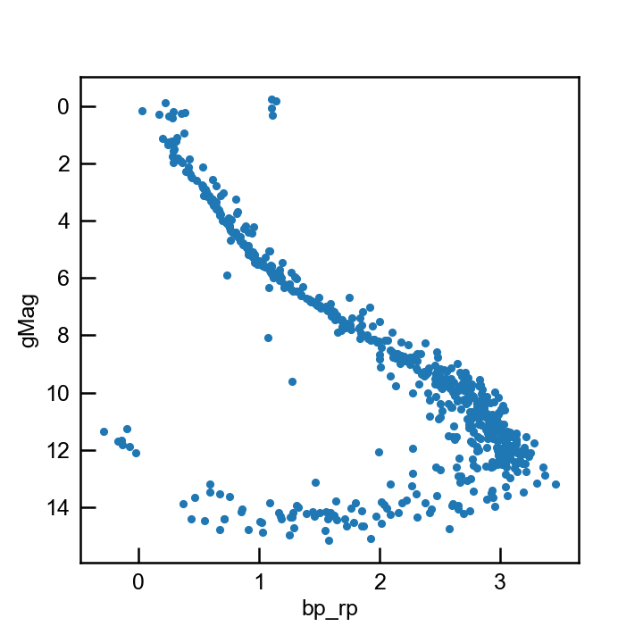

.. gapipes documentation master file, created by
   sphinx-quickstart on Thu Nov 22 19:06:27 2018.
   You can adapt this file completely to your liking, but it should at least
   contain the root `toctree` directive.

Welcome to gapipes!
===================

**gapipes** is a lightweight collection of routines to fetch and work with `Gaia <#>`_ data.

It provides

- sensible and tested interface to `Gaia TAP+ <http://gea.esac.esa.int/archive/>`_
- `pandas pipes <http://pandas.pydata.org/pandas-docs/stable/reference/api/pandas.DataFrame.pipe.html>`_ to process Gaia DataFrames quickly and easily
- custom accessors to pandas DataFrame and Series to do common operations on the Gaia data.

.. code-block:: python

  import gapipes as gp

  gp.gaia.query("""
  select *
  from gaiadr2.gaia_source
  where
    1=contains(point('', ra, dec),
               circle('', 130.226, 19.665, 1))
    and parallax between 4.613 and 7.312
  """).pipe(gp.add_gMag)\
      .plot.scatter('bp_rp', 'gMag').invert_yaxis();

User Guide
----------

.. toctree::
   :maxdepth: 2

   getting-started
   using-pipes

.. toctree::
   :maxdepth: 2
   :hidden:

   api
